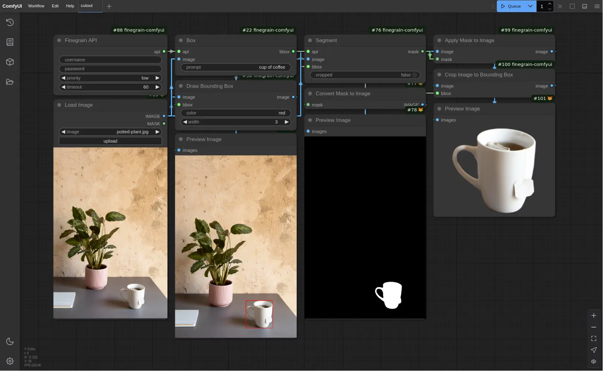
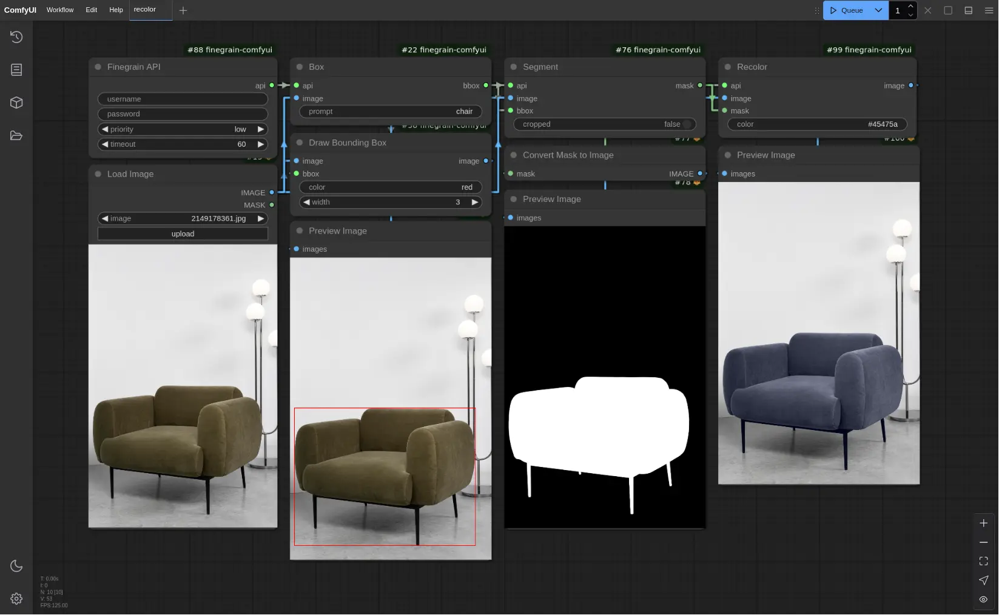
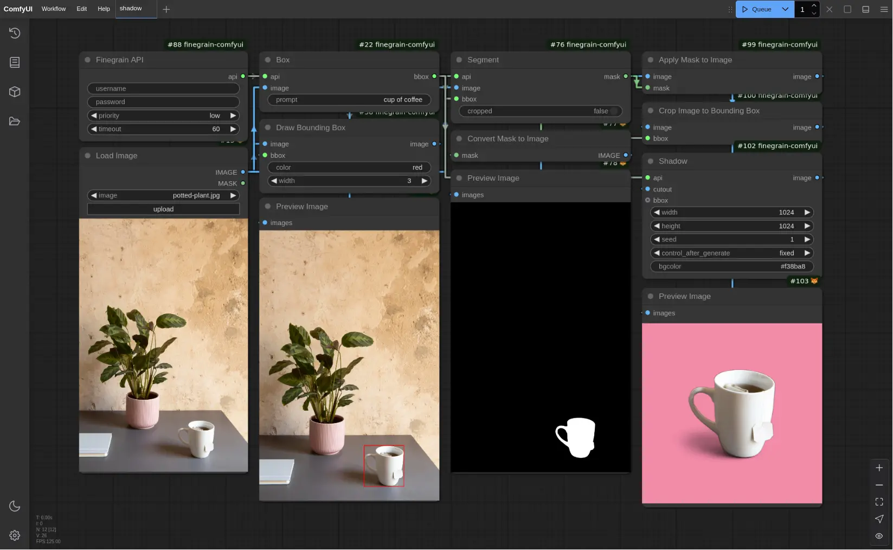
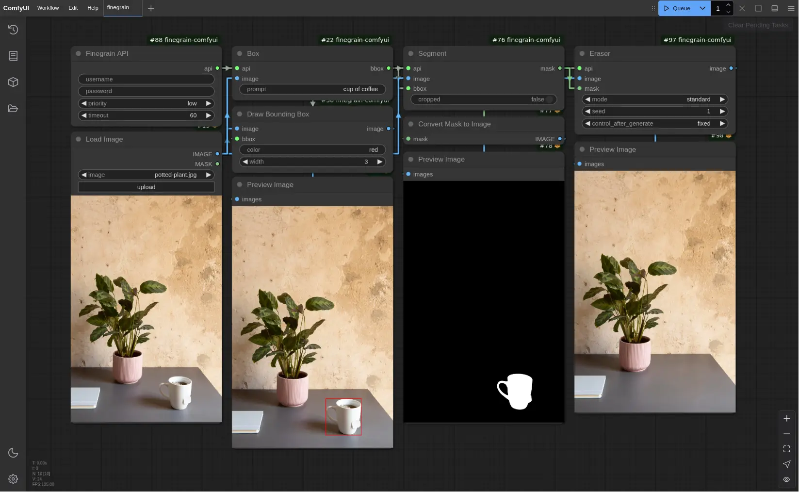
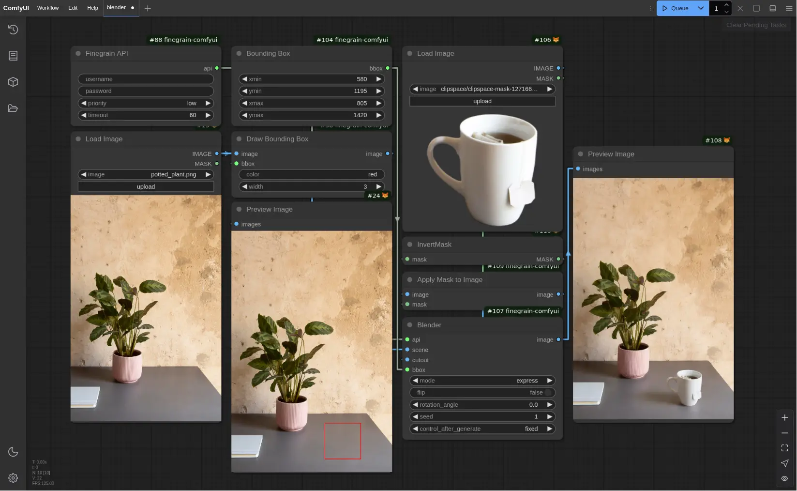

# comfyui-finegrain

[Finegrain API](https://api.finegrain.ai/doc/) ComfyUI custom nodes

## Installation

### Requirements

1. Ensure you have **Python 3.12** or later installed.

2. Ensure you have Git installed.

### Comfy Registry installation

The nodes are published at https://registry.comfy.org/publishers/finegrain/nodes/comfyui-finegrain.

1. Ensure you have Comfy CLI installed.

2. Install the custom nodes using Comfy CLI:

```bash
comfy node registry-install comfyui-finegrain
```

The above command should automatically install the nodes' requirements.
If it somehow doesn't, you can manually install them with:

```bash
# ensure you activated the python virtual environment used by ComfyUI
pip install -r custom_nodes/comfyui-finegrain/requirements.txt
```

Alternatively if you installed ComfyUI via the "Windows Standalone archive", you can install the requirements with:

```shell
.\python_embeded\Scripts\pip.exe install hatchling
.\python_embeded\Scripts\pip.exe install -r .\ComfyUI\custom_nodes\comfyui-finegrain\requirements.txt
```

### Manual installation

To manually install the nodes, you may alternatively do the following:

1. Download an archive of the nodes by cliking the "Download Latest" button at
https://registry.comfy.org/publishers/finegrain/nodes/comfyui-finegrain

2. Extract the archive:

```bash
unzip -d custom_nodes/comfyui-finegrain comfyui-finegrain.zip
rm comfyui-finegrain.zip
```

3. Install the nodes' requirements:

```bash
pip install -r custom_nodes/comfyui-finegrain/requirements.txt
```

Alternatively if you installed ComfyUI via the "Windows Standalone archive", you can install the requirements with:

```shell
.\python_embeded\Scripts\pip.exe install hatchling
.\python_embeded\Scripts\pip.exe install -r .\ComfyUI\custom_nodes\comfyui-finegrain\requirements.txt
```

## Workflow examples

All the below examples were made using v0.1.0 of the nodes.

### Object Cutout

[](assets/cutout.json)

### Object Recolor

[](assets/recolor.json)

### Shadow Creator

[](assets/shadow.json)

### Object Eraser

[](assets/eraser.json)

### Object Blender

[](assets/blender.json)
